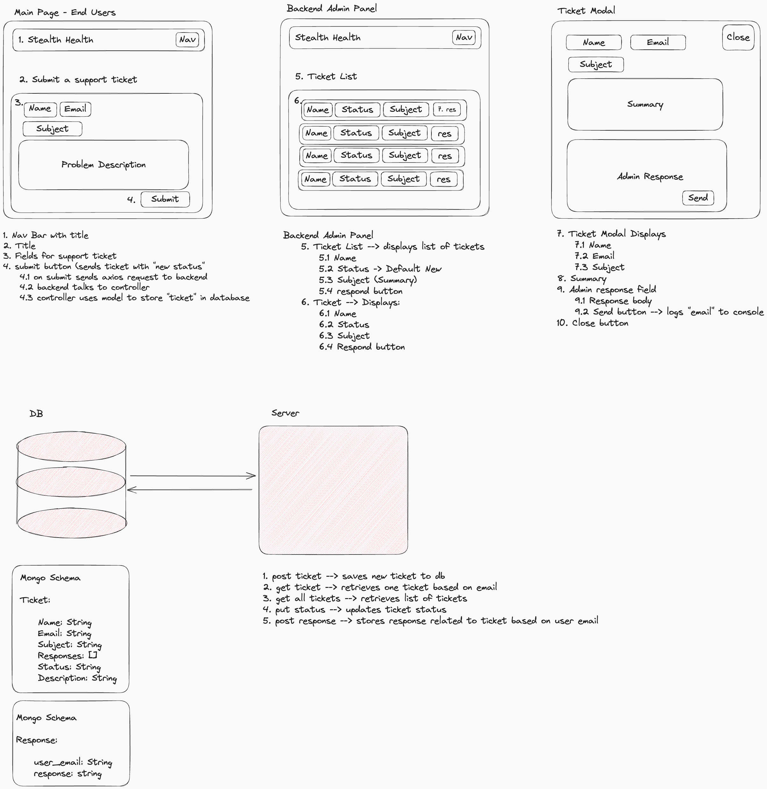

Certainly, here's a basic README for your support ticket management project:

# Support Tickets Management System

## Description

This project is a basic "help desk" / support system ticket management system, developed as a coding exercise for a stealth healthcare startup. It allows end users to submit support ticket requests and provides support staff with an admin panel to manage and respond to tickets.

## Demo Gif


## Quick Wireframe




## Features

- End users can submit support ticket requests.
- Support staff can view a list summary of each ticket, including its status.
- Support staff can drill down into a ticket to respond to a request and update its status.
- Possible ticket statuses: "new," "in progress," and "resolved."

## Technologies Used

- Front-end UI: React
- Backend: Express.js (Node.js)
- Database: MongoDB with Mongoose
- CSS Framework: Tailwind CSS
- HTTP Requests: Axios
- Environment Variables: dotenv
- Logging: Morgan
- Development Tools: ESLint

## Installation

1. Clone the repository:

   ```bash
   git clone https://github.com/your-username/support-tickets.git
   cd support-tickets
   ```

2. Install dependencies:

   ```bash
   npm install
   ```

3. Set up environment variables:

   Create a `.env` file in the root directory with the following variables:

   ```
   PORT=3000
   MONGODB_URI=your-mongodb-uri
   ```

   Replace `your-mongodb-uri` with your MongoDB connection URI.

## Usage

1. Start the server:

   ```bash
   npm run server
   ```

2. Start the API Server
    ```bash
   npm run server
   ```

3. Open your browser and navigate to `http://localhost:5173` to access the end user interface.

4. Access the admin panel by going to `http://localhost:5173/admin`. Here, support staff can manage and respond to support tickets.

## Build for Production

To build the project for production:

```bash
npm run build
```

## Deployment

This project can be deployed to a hosting service like Vercel or a cloud platform like Heroku. Make sure to set up environment variables for production as well.

## Demo

A live demo of this project is available at [Demo URL](https://your-demo-url.com).

Note: The email functionality has been simulated with logging for the sake of the exercise.

## License

This project is licensed under the MIT License - see the [LICENSE](LICENSE) file for details.

## Acknowledgments

- This project was developed as a coding exercise for a stealth healthcare startup.
- Special thanks to the development team for their contributions.

Feel free to customize this README to include additional information or instructions specific to your project.
